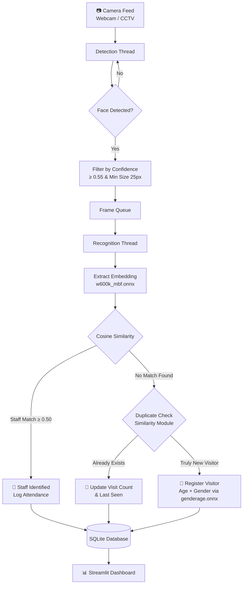
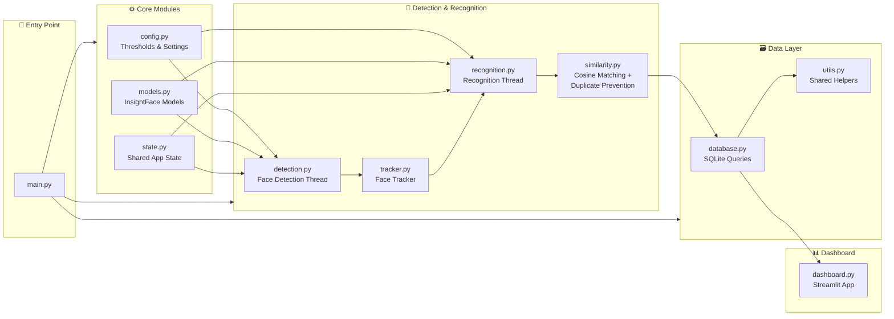
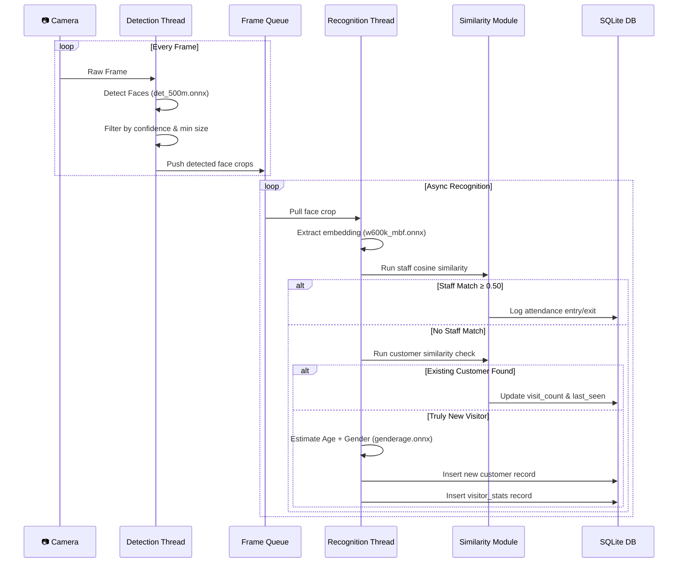
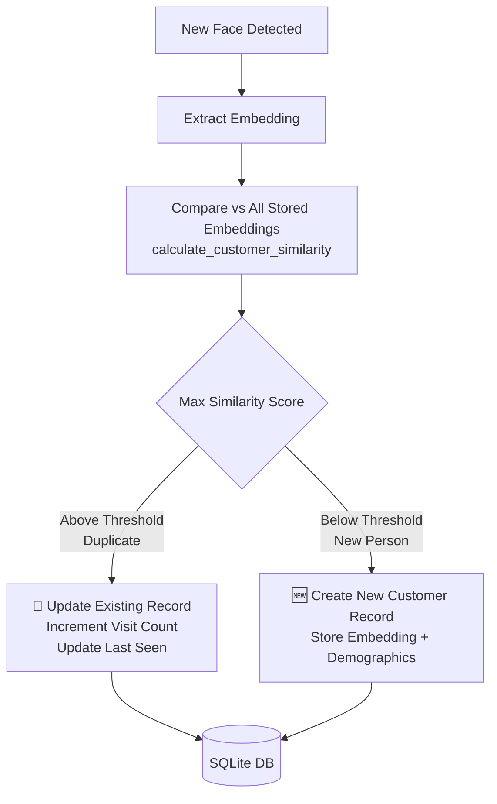
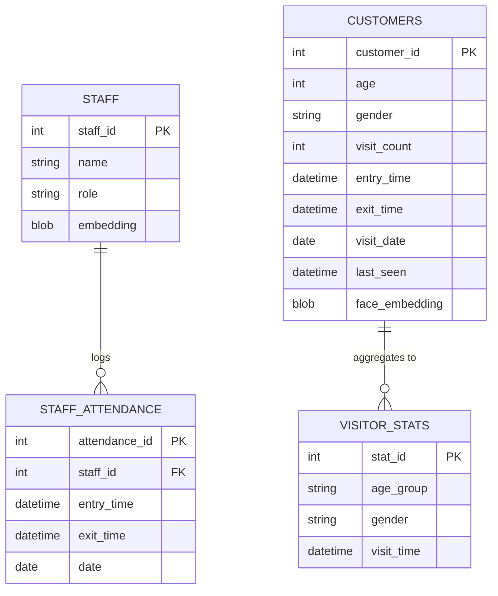
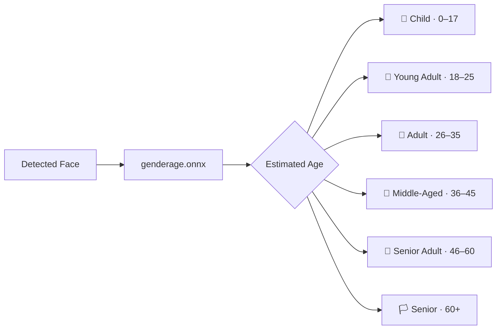

<div align="center">


# 🏪 AI Retail Visitor Analytics System

**Real-time face detection, staff recognition, visitor deduplication, and analytics dashboard for retail environments.**

[Features](#-features) • [Architecture](#-system-architecture) • [Trackers](#-object-trackers) • [Installation](#-installation) • [Usage](#-usage) • [Database](#-database-schema) • [Progress](#-project-progress) • [Future Work](#-future-improvements)

</div>

---

## 📌 Overview

The **AI Retail Visitor Analytics System** is a fully completed, production-ready real-time analytics platform built for retail CCTV and live camera feeds. It detects faces, identifies registered staff, counts unique customers, estimates visitor demographics, logs attendance, and presents live analytics through a Streamlit dashboard — all while preventing duplicate visitor entries through embedding-based similarity deduplication.

> ✅ **Project Status: Complete** — All core modules, duplicate prevention, dashboard, and tracker evaluation finished as of **10 June 2026**.

---

## ✨ Features

| Feature | Description | Status |
|---|---|---|
| 🎯 Face Detection | Real-time detection from webcam or CCTV using InsightFace | ✅ Complete |
| 👤 Staff Recognition | Cosine similarity on face embeddings with attendance logging | ✅ Complete |
| 🧍 Unique Visitor Counting | Embedding-based deduplication preventing duplicate entries | ✅ Complete |
| 📊 Demographic Analysis | Age group + gender estimation per detected visitor | ✅ Complete |
| 🕐 Attendance Logging | Automatic staff check-in / check-out with timestamps | ✅ Complete |
| 🔀 Multi-threaded Pipeline | Dedicated detection and recognition threads for real-time perf | ✅ Complete |
| 🔁 Duplicate Prevention | Similarity verification before every customer insertion | ✅ Complete |
| 📈 Analytics Dashboard | Live Streamlit dashboard with visitor and attendance reports | ✅ Complete |
| 🚀 Tracker Evaluation | ByteTrack (Supervision v0.28) and Centroid Tracker both tested | ✅ Complete |

---

## 🏗️ System Architecture

### High-Level Pipeline



### Module Architecture



### Multi-Threading Sequence



### Duplicate Visitor Prevention Flow



### Database Entity Relationships



### Age Group Classification



---

## 🧠 Tech Stack

| Component | Technology |
|---|---|
| Language | Python 3.9+ |
| Face Analytics | InsightFace (buffalo_s) |
| Computer Vision | OpenCV |
| Database | SQLite |
| Similarity Matching | Scikit-Learn (Cosine Similarity) |
| Numerical Computing | NumPy |
| Threading | Python `threading` |
| Dashboard | Streamlit |
| Object Tracking | FaceCentroidTracker / ByteTrack (Supervision v0.28) |
| Environment | Miniconda |


---

## 🚀 Object Trackers

Two tracking approaches were implemented and evaluated for this project:

### 1. FaceCentroidTracker *(Primary — Custom Implementation)*

A lightweight custom tracker built specifically for this pipeline.

- Assigns track IDs based on centroid distance between frames
- Handles track persistence across brief occlusions
- Manages lost track recovery and ID continuity
- Integrated directly into `tracker.py`

### 2. ByteTrack *(Evaluated — via Supervision v0.28)*

ByteTrack was evaluated as an upgrade to the centroid tracker, sourced from the [Supervision](https://github.com/roboflow/supervision) library.

```python
# ByteTrack usage via Supervision v0.28
import supervision as sv
tracker = sv.ByteTracker()
```

> ⚠️ **Compatibility Note:** ByteTrack is available in **Supervision v0.28**. It was deprecated and removed in **v0.30+**. If you intend to use ByteTrack, pin your Supervision version explicitly:
>
> ```
> supervision==0.28.0
> ```
>
> Alternatively, for v0.30+, use `sv.InferenceSlicer` or switch to a standalone ByteTrack implementation.

Both trackers were tested in the full pipeline. The centroid tracker remains the default integration due to its stability and zero external dependency.

---

## 🤖 InsightFace Models

| Model File | Purpose |
|---|---|
| `det_500m.onnx` | Face Detection |
| `w600k_mbf.onnx` | Face Recognition (embedding extraction) |
| `genderage.onnx` | Age & Gender Estimation |
| `2d106det.onnx` | 2D Facial Landmark Detection |

> Model pack: **buffalo_s** — lightweight and optimised for real-time retail inference.

---

## ⚙️ Configuration

Key thresholds in `config.py`:

| Parameter | Default |
|---|---|
| Detection Confidence | `≥ 0.55` |
| Minimum Face Width | `25 px` |
| Minimum Face Height | `25 px` |
| Staff Recognition Threshold | `0.50` (cosine similarity) |
| Camera Source | `0` (default webcam) |

---

## 📁 Project Structure

```
customer_recognition/
│
├── config.py           # Global thresholds, camera source, and model config
├── models.py           # InsightFace model loader (buffalo_s pack)
├── database.py         # SQLite schema creation and query helpers
├── tracker.py          # FaceCentroidTracker — track assignment & persistence
├── similarity.py       # Cosine similarity: staff matching & customer deduplication
├── detection.py        # Detection thread — face detection & confidence filtering
├── recognition.py      # Recognition thread — embeddings, matching, DB writes
├── utils.py            # Shared utility functions
├── state.py            # Thread-safe shared application state
├── main.py             # Application entry point
├── dashboard.py        # Streamlit analytics dashboard
├── staff_register.py   # CLI tool for staff face enrollment
├── requirements.txt
└── README.md
```

---

## 📦 Installation

### Prerequisites

- [Miniconda](https://docs.conda.io/en/latest/miniconda.html) or [Docker](https://www.docker.com/) installed
- Webcam or RTSP CCTV stream accessible to the host machine

---

### Option A — Miniconda *(Recommended for Development)*

```bash
# 1. Clone the repository
git clone https://github.com/aleenaann012-droid/customer_recognition.git
cd customer_recognition

# 2. Create the Conda environment from the spec file
conda env create -f environment.yml

# 3. Activate the environment
conda activate retail-analytics

# 4. Verify InsightFace models are available
#    InsightFace will auto-download buffalo_s on first run, or place manually at:
#    ~/.insightface/models/buffalo_s/
```

> **GPU Acceleration:** To enable CUDA inference, ensure `onnxruntime-gpu` is listed in `environment.yml` and that your CUDA toolkit version matches. Run `nvidia-smi` to confirm your driver version.

> **ByteTrack (optional):** If evaluating the ByteTrack branch, ensure `supervision==0.28.0` is pinned — it was removed in v0.30+.

---

### Option B — Docker *(Recommended for Deployment)*

The system is containerised and can be deployed with a single command using Docker.

```bash
# 1. Clone the repository
git clone https://github.com/aleenaann012-droid/customer_recognition.git
cd customer_recognition

# 2. Build the Docker image
docker build -t retail-analytics .

# 3. Run the container
#    --device passes your webcam into the container
docker run --rm -it \
  --device=/dev/video0:/dev/video0 \
  -p 8501:8501 \
  retail-analytics
```


The Streamlit dashboard will be accessible at `http://localhost:8501`.

> **Camera access in Docker:** On Linux, pass `--device=/dev/video0`. On Windows/macOS with Docker Desktop, camera passthrough may require additional configuration or running natively via Miniconda instead.

> **GPU in Docker:** Add `--gpus all` to the `docker run` command and use the `nvidia/cuda` base image in your `Dockerfile` for GPU-accelerated inference inside the container.

---

## ▶️ Usage

### 1. Register Staff

```bash
python staff_register.py --name "Jane Doe" --role "Manager"
```

Captures a live face sample, generates a 512-d embedding, and stores it in the `staff` table.

### 2. Run the Analytics System

```bash
python main.py
```

The system will:
- Open the configured camera feed
- Launch detection and recognition threads
- Perform real-time deduplication before every visitor insertion
- Log staff attendance and visitor records to SQLite

### 3. Launch the Dashboard

```bash
streamlit run dashboard.py
```

Opens the Streamlit dashboard in your browser with live:
- Total visitor counts
- Gender distribution charts
- Age group breakdown
- Staff attendance logs
- Repeat visitor statistics

---

## 🗃️ Database Schema

### `customers`
Stores each unique visitor with age, gender, visit count, entry/exit timestamps, and face embedding used for deduplication on future visits.

### `staff`
Stores registered staff members with name, role, and face embedding for real-time recognition.

### `staff_attendance`
Records daily entry and exit events per staff member, enabling attendance reporting.

### `visitor_stats`
Aggregated visit records by age group and gender, feeding the dashboard charts.

---

## 📊 Project Progress

| Module | Status | Completion |
|---|---|---|
| Database Design | ✅ Complete | 100% |
| Staff Registration | ✅ Complete | 100% |
| Detection Pipeline | ✅ Complete | 100% |
| Recognition Pipeline | ✅ Complete | 100% |
| Visitor Analytics | ✅ Complete | 100% |
| Similarity Module | ✅ Complete | 100% |
| Duplicate Visitor Prevention | ✅ Complete | 100% |
| Modular Refactoring | ✅ Complete | 100% |
| Multi-threading | ✅ Complete | 100% |
| main.py Integration | ✅ Complete | 100% |
| Analytics Dashboard (Streamlit) | ✅ Complete | 100% |
| Tracker Evaluation (Centroid + ByteTrack) | ✅ Complete | 100% |

**Overall Project Completion: ✅ 100% — Delivered 10 June 2026**

---

## 🔮 Future Improvements

The core system is complete. The following enhancements are recommended for future iterations:

### 📷 Multiple Camera Integration
The current system supports a single camera source. The architecture can be extended to support multiple simultaneous CCTV feeds by spawning independent detection/recognition thread pairs per camera, sharing a common SQLite database. This enables full-store coverage across multiple zones.

### 🔍 Re-Identification (Re-ID) for Better Tracking
Integrating a dedicated Re-ID model (e.g., OSNet, FastReID) would improve tracking continuity across camera handoffs, occlusion events, and large gaps in detection. Re-ID operates on full body appearance rather than face alone, making it robust in environments where faces are partially obscured.

### 🗺️ Heatmap Analysis
By logging bounding box positions and timestamps, the system can generate spatial heatmaps showing which areas of the store receive the most foot traffic. This can be visualised on a store floor plan overlay in the dashboard, enabling layout and merchandising decisions based on real visitor movement data.

---

## 🤝 Contributing

Pull requests are welcome. For major changes, please open an issue first to discuss your proposal.

```bash
# Fork and create a feature branch
git checkout -b feature/your-feature-name

# Commit with a descriptive message
git commit -m "feat: describe your change"

# Push and open a Pull Request
git push origin feature/your-feature-name
```

Please follow PEP 8 style conventions and include docstrings for any new modules.

---

<div align="center">

Built with ❤️ using InsightFace · OpenCV · Streamlit · Python · Docker · Miniconda

</div>
